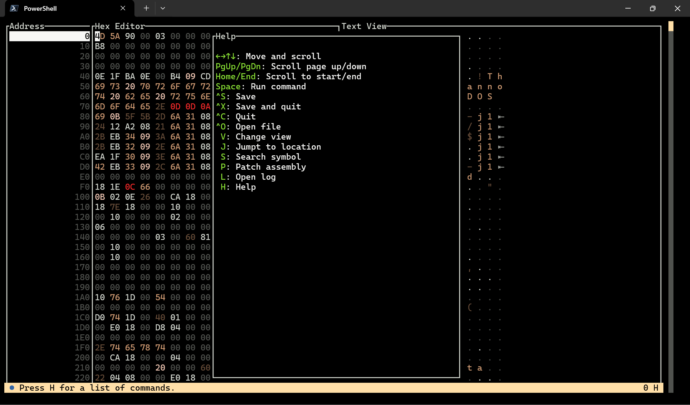
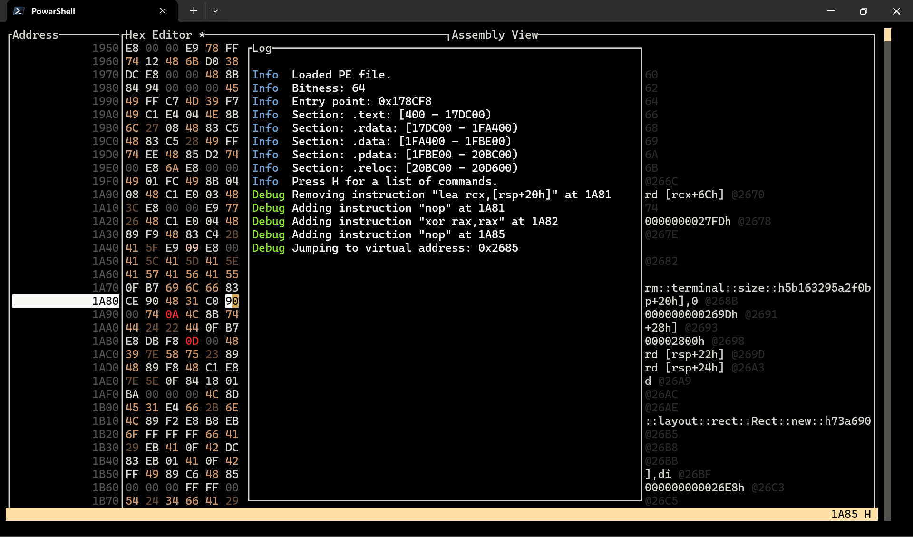
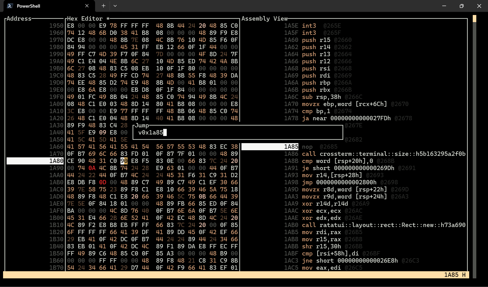
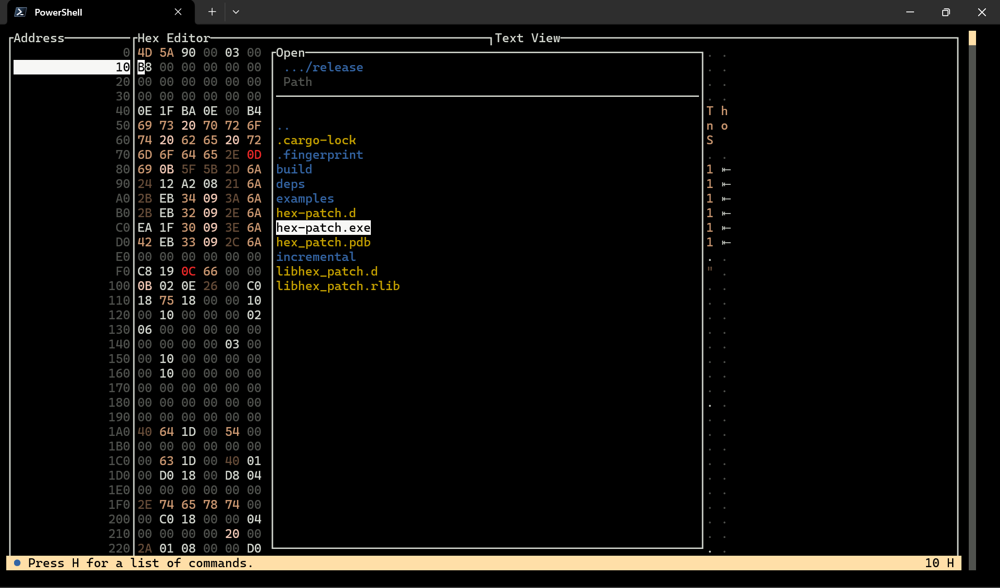
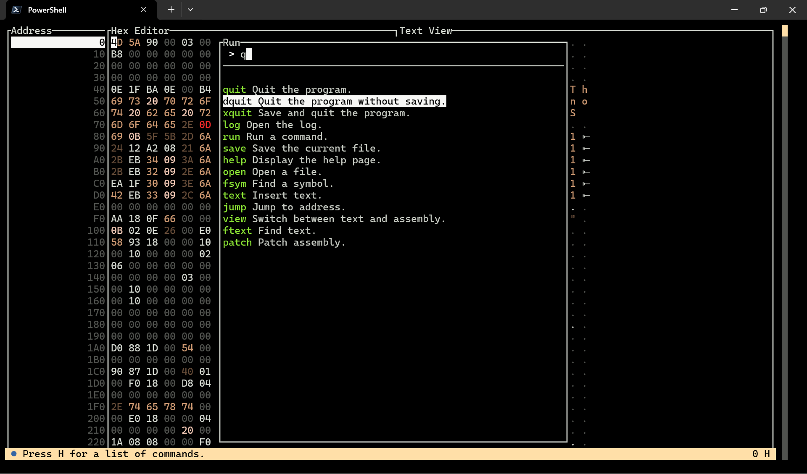
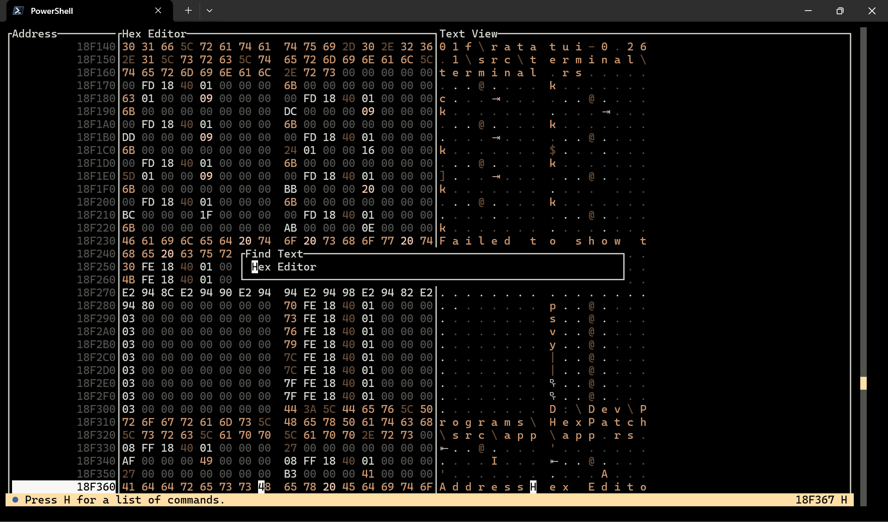
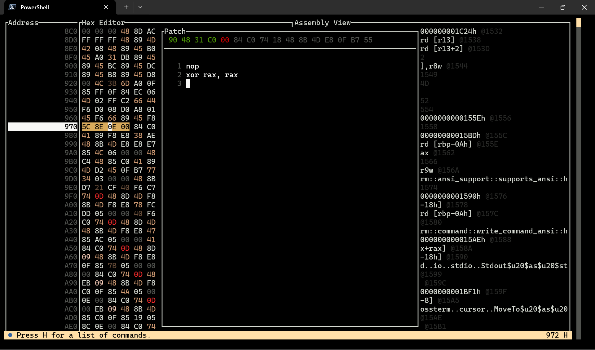

#  HexPatch

HexPatch is a binary patcher and editor with terminal user interface (TUI), it's capable of disassembling instructions and assembling patches.
It supports PE and ELF executables, both with debug symbols.

## Supported file formats

Both ELF and PE files are supported, only amd64 and i386 architectures are supported.

There may be issues with i386 executables, please report any issues.

## Features

- Help menu
    

- Log
    
    Press `DELETE` to clear the log.

- Text view
    

- Jump to address
    
    Jump to a virtual address with `v0x` or to a file offset with `0x`. You can also jump to symbols and sections.

- Open file
    

- Run command
    

- Find text
    

- Find symbol
    

- Insert Text
    

- Patch
    
    Create a new line with `SHIFT + ENTER`.

## Patching

You need one of the following assembler installed and available in your PATH:

- [nasm](https://www.nasm.us/)
- [yasm](http://yasm.tortall.net/)
- [gas](https://www.gnu.org/software/binutils/)
- [llvm-as](https://llvm.org/docs/CommandGuide/llvm-as.html)

This functionality is tested mainly with `nasm`. Please report any issues with other assemblers.

## Known issues

- Some key combinations may not work as expected, notably `SHIFT + ENTER` on VSCode terminal. Please refer to [this issue](https://github.com/crossterm-rs/crossterm/issues/685) for more information. Unfortunately, this behavior is out of my control.

## Special thanks

Thanks to [Lorenzo Colombini](https://github.com/Lorenzinco) for the instruction highlighting.
