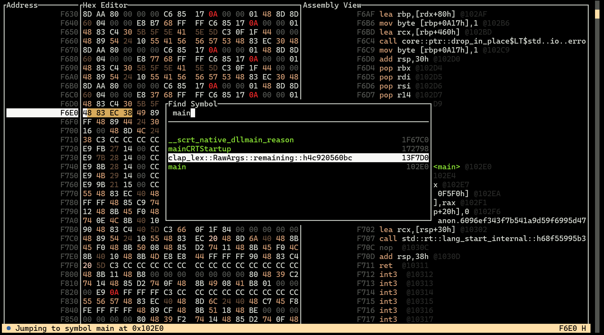

#  HexPatch

HexPatch is a binary patcher and editor with terminal user interface (TUI), it's capable of disassembling instructions and assembling patches.
It supports PE and ELF executables, both with debug symbols.

