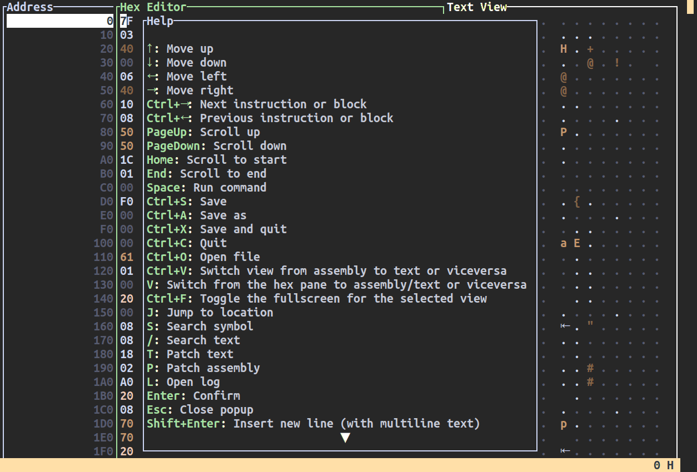

# Screenshots

<a href="./assets/screenshots/main_view.png">

 <small>Main view</small>
</a>

<a href="./assets/screenshots/fullscreen_assembly.png">

 <small>Fullscreen assembly</small>
</a>

<a href="./assets/screenshots/fullscreen_hex.png">
  
 <small>Fullscreen hex</small>
</a>

<a href="./assets/screenshots/fullscreen_text.png">

 <small>Fullscreen text</small>
</a>

<a href="./assets/screenshots/help.png">
 
 <small>Help menu</small>
</a>

<a href="./assets/screenshots/log.png">

 <small>Log</small>
</a>

<a href="./assets/screenshots/jump.png">

 <small>Jump to address</small>
</a>

<a href="./assets/screenshots/open.png">

 <small>Open file</small>
</a>

<a href="./assets/screenshots/run.png">

 <small>Run command</small>
</a>

<a href="./assets/screenshots/find_text.png">

 <small>Find text</small>
</a>

<a href="./assets/screenshots/find_symbol.png">

 <small>Find symbol</small>
</a>

<a href="./assets/screenshots/insert_text.png">

 <small>Insert Text</small>
</a>

<a href="./assets/screenshots/patch.png">

 <small>Patch</small>
</a>

